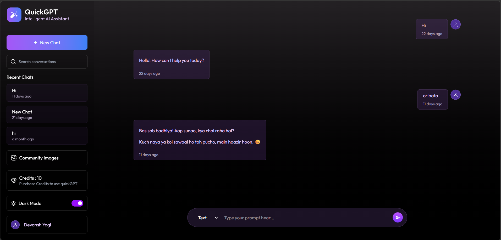
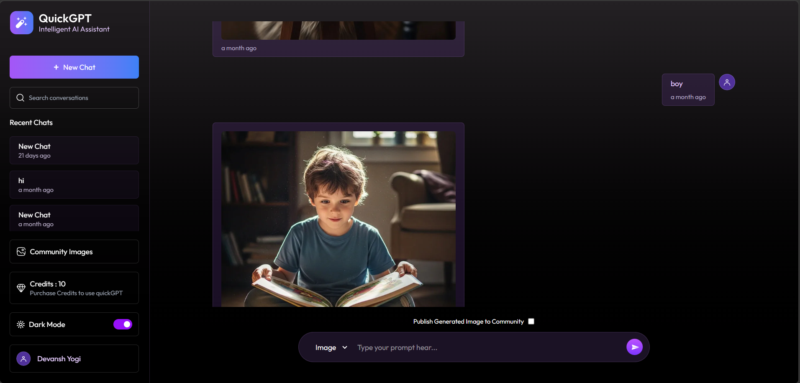
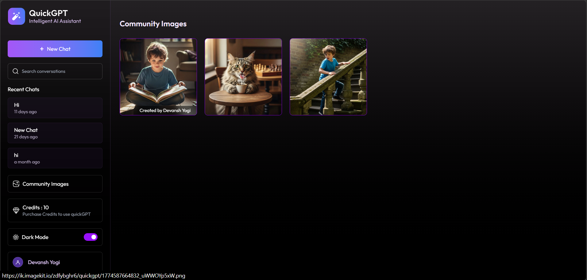
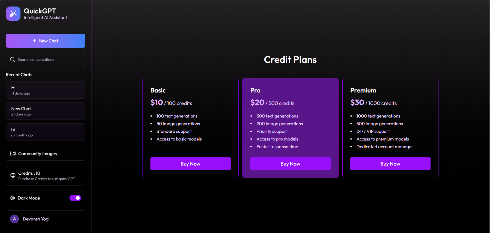

# 🚀 QuickGPT - AI Chat & Image Generator  


---

## 🌐 Live Demo  
👉 https://quick-gpt-xi-sable.vercel.app/  

---

👉 ImageKit: https://tinyurl.com/bdzjb55k

👉 GitHub: https://github.com/bs-bhaskar/QuickGPT.git

👉 ImageKit docs:  https://tinyurl.com/tnybufw3


## 📸 Screenshots  

### 💬 Chat Interface  


### 🎨 Image Generation  


### 🌍 Community Page  


### 💳 Credit Plans  


---

## ✨ Features  

- 🔐 JWT Authentication (Login / Register)  
- 💬 AI Chat (Text Generation)  
- 🎨 AI Image Generation  
- 🌍 Community Image Sharing  
- 💳 Credit-Based Usage System  
- ⚡ Fast & Responsive UI  
- 🌙 Dark / Light Mode  
- 🧠 Markdown + Code Highlighting  

---

## 🛠️ Tech Stack  

### Frontend  
- React.js (Vite)  
- Tailwind CSS  
- Axios  
- React Router DOM  
- React Markdown + PrismJS  

### Backend  
- Node.js + Express  
- MongoDB (Mongoose)  
- JWT Authentication  
- Stripe Payment Gateway  
- ImageKit CDN  
- Gemini AI (OpenAI compatible API)  

---

## 📂 Project Structure  

```bash
client/   # Frontend (React)
server/   # Backend (Node + Express)

TREE STRUCTURE
Full_Stack_ChatGPT_Using_React_JS-OpenAI-ImageKit
├── client/
│   ├── public/
│   │   └── favicon.svg
│   ├── src/
│   │   ├── assets/          (Images and Icons)
│   │   ├── components/
│   │   │   ├── ChatBox.jsx
│   │   │   ├── Message.jsx
│   │   │   └── Sidebar.jsx
│   │   ├── context/
│   │   │   └── AppContext.jsx
│   │   ├── pages/
│   │   │   ├── Community.jsx
│   │   │   ├── Credits.jsx
│   │   │   ├── Loading.jsx
│   │   │   └── Login.jsx
│   │   ├── App.jsx
│   │   ├── index.css
│   │   └── main.jsx
│   ├── .env
│   ├── index.html
│   ├── package.json
│   ├── vercel.json
│   └── vite.config.js
└── server/
    ├── configs/
    │   ├── db.js            (MongoDB Connection)
    │   ├── imageKit.js
    │   └── openai.js
    ├── controllers/
    │   ├── chatController.js
    │   ├── creditController.js
    │   ├── messageController.js
    │   ├── userController.js
    │   └── webhooks.js
    ├── middlewares/
    │   └── auth.js          (JWT/Auth Logic)
    ├── models/              (Mongoose Schemas)
    │   ├── Chat.js
    │   ├── Transaction.js
    │   └── User.js
    ├── routes/
    │   ├── chatRoutes.js
    │   ├── creditRoutes.js
    │   ├── messageRoutes.js
    │   └── userRoutes.js
    ├── .env
    ├── package.json
    ├── server.js            (Main Entry Point)
    └── vercel.json
```

---

## ⚙️ Setup Instructions  

### 1️⃣ Clone Repo  
```bash
git clone https://github.com/bs-bhaskar/QuickGPT.git
cd QuickGPT
```

### 2️⃣ Backend Setup  
```bash
cd server
npm install
npm run server
npm init -y
npm install express cors dotenv mongoose jsonwebtoken bcryptjs
npm install --save-dev nodemon
npm install openai
npm install @imagekit/nodejs
npm install axios
npm install stripe
npm install svix
```

### 3️⃣ Frontend Setup  
```bash
cd client
npm install
npm run dev
install npm packge
install npm route packge 
install npm tailwind packge 
install npm moment packge 
install npm react-markdown packge
install npm prismjs packge
npm install axios react-hot-toast
```

---

## 🔄 Application Flow  

User → Login → Token  
→ Send Prompt  
→ Backend → AI / ImageKit  
→ Response → UI  
→ Credits Deduct  
→ Stripe Payment → Webhook → Credits Added  

---

## 💳 Payment Flow  

1. User selects plan  
2. Redirect to Stripe  
3. Payment success  
4. Webhook triggered  
5. Credits updated  

---

## 🧠 Key Concepts  

- Context API (Global State)  
- REST API Integration  
- Authentication & Authorization  
- MongoDB Aggregation  
- Webhooks (Stripe)  
- Optimistic UI  

---

## ⚠️ Important  

- ❌ Do NOT push `.env`  
- ⚠️ Secure your API keys  
- 🔌 Backend must be running  

---

## 🚀 Deployment  

- Frontend → Vercel  
- Backend → Render  

---

## 👨‍💻 Author  

Bhaskar Yogi

---

## ⭐ Show Your Support  

If you like this project, give it a ⭐ on GitHub 🚀  

